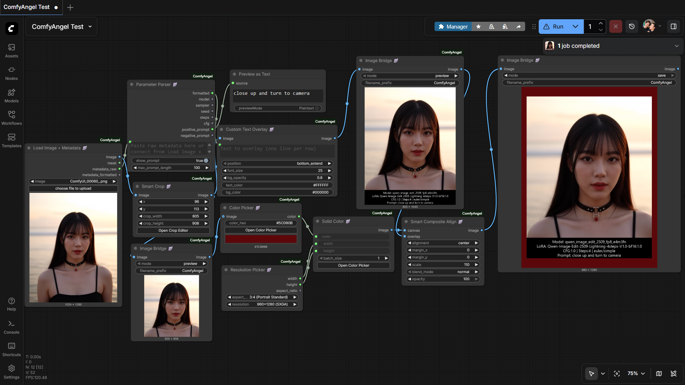
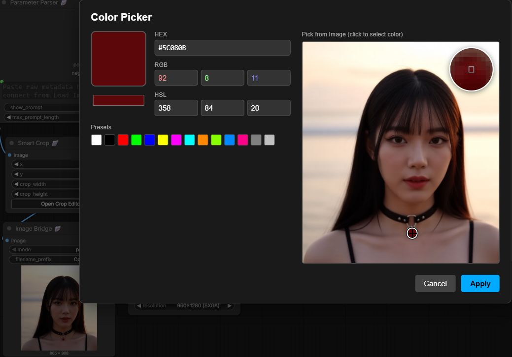
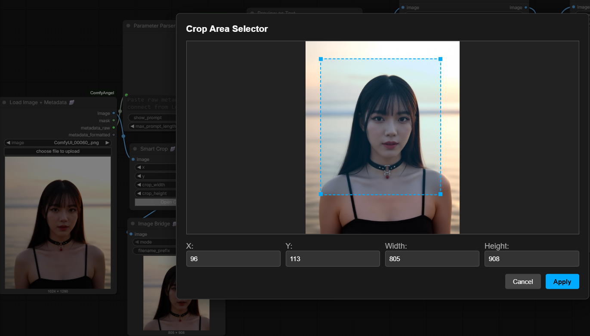

# ComfyAngel

Parameter Overlay & Visual Widget nodes for ComfyUI

**Display generation parameters directly on your images** - perfect for sharing, comparing, and archiving your AI art.

## Screenshots

### Example Workflow


[Download Example Workflow (JSON)](examples/ComfyAngel%20Example.json)

### Color Picker with Eyedropper


### Smart Crop Editor


---

## Installation

### ComfyUI Registry (Recommended)
```bash
comfy node install comfyangel
```

### ComfyUI Manager
Search for "ComfyAngel" in ComfyUI Manager and click Install.

### Manual Installation
```bash
cd ComfyUI/custom_nodes
git clone https://github.com/ThepExcel/ComfyAngel.git
```

Then restart ComfyUI.

---

## Nodes

### Loader Nodes

#### Load Image from Folder 🪽

Load images from a folder one at a time for loop processing.

| Input | Type | Description |
|-------|------|-------------|
| folder_path | STRING | Path to folder containing images |
| index | INT | Image index (has control_after_generate for auto-increment) |
| sort_by | ENUM | `name`, `modified_date`, `created_date` |
| loop | BOOLEAN | Loop back to first image when reaching end (default: true) |
| include_subdirs | BOOLEAN | Include images in subfolders (default: false) |

| Output | Type | Description |
|--------|------|-------------|
| image | IMAGE | Current image |
| mask | MASK | Alpha channel as mask |
| filename | STRING | Filename without extension |
| filename_ext | STRING | Filename with extension |
| metadata_raw | STRING | Raw metadata from PNG file |
| index | INT | Current index |
| total_count | INT | Total images in folder |

**Use with Auto Queue:** Set index to "increment" mode, enable Auto Queue, and process entire folders automatically.

---

#### Load Images from Folder as BATCH 🪽

Load ALL images from a folder as a batch tensor.

| Input | Type | Description |
|-------|------|-------------|
| folder_path | STRING | Path to folder containing images |
| sort_by | ENUM | `name`, `modified_date`, `created_date` |
| max_images | INT | Maximum images to load (0 = unlimited) |
| start_index | INT | Skip first N images |
| include_subdirs | BOOLEAN | Include images in subfolders (default: false) |

| Output | Type | Description |
|--------|------|-------------|
| images | IMAGE | Batch tensor (all images stacked) |
| filenames | STRING | Newline-separated list of filenames |
| count | INT | Number of images loaded |

**Note:** All images are resized to match the first image's dimensions.

---

#### Split Image Batch 🪽

Split a batch of images and output one at a time.

| Input | Type | Description |
|-------|------|-------------|
| images | IMAGE | Batch of images |
| index | INT | Image index (has control_after_generate for auto-increment) |
| loop | BOOLEAN | Loop back when reaching end (default: true) |

| Output | Type | Description |
|--------|------|-------------|
| image | IMAGE | Single image at index |
| index | INT | Current index |
| total_count | INT | Total images in batch |

**Use case:** Combine with "Load Images from Folder as BATCH" to process batch images one at a time.

---

### Overlay Nodes

#### Load Image + Metadata 🪽

Load image and extract embedded metadata from PNG files.

| Input | Type | Description |
|-------|------|-------------|
| image | IMAGE_UPLOAD | Select image file to load |

| Output | Type | Description |
|--------|------|-------------|
| image | IMAGE | The loaded image |
| mask | MASK | Alpha channel as mask (if exists) |
| metadata_raw | STRING | Raw metadata string (JSON or A1111 format) |
| metadata_formatted | STRING | Human-readable formatted metadata |

**Supported formats:** A1111/Civitai PNG parameters, ComfyUI embedded workflow

---

#### Parameter Parser 🪽

Parse raw metadata string and extract individual generation parameters.

| Input | Type | Description |
|-------|------|-------------|
| metadata | STRING | Raw metadata (from Load Image + Metadata or paste manually) |
| show_prompt | BOOLEAN | Include prompt in formatted output (default: true) |
| max_prompt_length | INT | Maximum characters for prompt (default: 100) |

| Output | Type | Description |
|--------|------|-------------|
| formatted | STRING | Human-readable summary |
| model | STRING | Model/checkpoint name |
| sampler | STRING | Sampler name with scheduler |
| seed | INT | Generation seed |
| steps | INT | Number of steps |
| cfg | FLOAT | CFG scale value |
| positive_prompt | STRING | Positive prompt text |
| negative_prompt | STRING | Negative prompt text |

---

#### Parameter Overlay 🪽

Add generation parameters as visual overlay on image.

| Input | Type | Description |
|-------|------|-------------|
| image | IMAGE | Image to add overlay to |
| image_path | STRING | Path to image with metadata (optional) |
| metadata_text | STRING | Raw metadata text (optional) |
| position | ENUM | `bottom_extend`, `bottom_inside`, `top_inside` |
| font_size | INT | Font size 8-100 (default: 25) |
| bg_opacity | FLOAT | Background opacity 0.0-1.0 (default: 0.7) |
| show_prompt | BOOLEAN | Show prompt in overlay (default: false) |
| max_prompt_length | INT | Max prompt chars, 0 = unlimited (default: 200) |

| Output | Type | Description |
|--------|------|-------------|
| image | IMAGE | Image with parameter overlay |

**Features:**
- Auto word-wrap for long text
- Supports Thai and Unicode fonts

---

#### Custom Text Overlay 🪽

Add custom text overlay with full styling control.

| Input | Type | Description |
|-------|------|-------------|
| image | IMAGE | Image to add overlay to |
| text | STRING | Text to display (multiline supported) |
| position | ENUM | `bottom_extend`, `bottom_inside`, `top_inside` |
| font_size | INT | Font size 8-100 (default: 25) |
| bg_opacity | FLOAT | Background opacity 0.0-1.0 (default: 0.7) |
| text_color | STRING | Text color in hex (default: #FFFFFF) |
| bg_color | STRING | Background color in hex (default: #000000) |

| Output | Type | Description |
|--------|------|-------------|
| image | IMAGE | Image with text overlay |

**Features:**
- Auto word-wrap for long text
- Supports Thai and Unicode fonts

---

### Utility Nodes

#### Image Bridge 🪽

Pass-through node with preview or save functionality.

| Input | Type | Description |
|-------|------|-------------|
| image | IMAGE | Image to preview/save |
| mode | ENUM | `preview` (show in UI) or `save` (save to output folder) |
| filename_prefix | STRING | Prefix for saved files (default: ComfyAngel) |

| Output | Type | Description |
|--------|------|-------------|
| image | IMAGE | Same image (pass-through) |

**Use case:** Insert between nodes to preview intermediate results while continuing the workflow.

---

#### Workflow Metadata 🪽

Output the current workflow/prompt as JSON string.

| Input | Type | Description |
|-------|------|-------------|
| (none) | - | Uses hidden prompt and workflow inputs |

| Output | Type | Description |
|--------|------|-------------|
| prompt_json | STRING | Current prompt/nodes as JSON |
| workflow_json | STRING | Full workflow as JSON |

**Use case:** Debug workflows, embed workflow info, or analyze execution.

---

#### Image Info 🪽

Get image dimensions and batch information.

| Input | Type | Description |
|-------|------|-------------|
| image | IMAGE | Image to analyze |

| Output | Type | Description |
|--------|------|-------------|
| width | INT | Image width |
| height | INT | Image height |
| channels | INT | Number of channels (3 for RGB) |
| batch_size | INT | Number of images in batch |

---

### Composite Nodes

#### Smart Composite XY 🪽

Composite overlay image onto canvas using X,Y coordinates.

| Input | Type | Description |
|-------|------|-------------|
| canvas | IMAGE | Background image |
| overlay | IMAGE | Image to place on top |
| x | INT | X position (-8192 to 8192) |
| y | INT | Y position (-8192 to 8192) |
| anchor | ENUM | Anchor point: `top_left`, `center`, `bottom_right`, etc. |
| scale | FLOAT | Scale percentage 1-500% (default: 100) |
| blend_mode | ENUM | `normal`, `multiply`, `screen`, `overlay`, etc. |
| opacity | FLOAT | Opacity 0-100% (default: 100) |

| Output | Type | Description |
|--------|------|-------------|
| image | IMAGE | Composited image |

---

#### Smart Composite Align 🪽

Composite overlay image onto canvas using alignment presets.

| Input | Type | Description |
|-------|------|-------------|
| canvas | IMAGE | Background image |
| overlay | IMAGE | Image to place on top |
| alignment | ENUM | Position: `top_left`, `center`, `bottom_right`, etc. |
| margin_x | INT | Horizontal margin (-8192 to 8192) |
| margin_y | INT | Vertical margin (-8192 to 8192) |
| scale | FLOAT | Scale percentage 1-500% (default: 100) |
| blend_mode | ENUM | Same as Smart Composite XY |
| opacity | FLOAT | Opacity 0-100% (default: 100) |

| Output | Type | Description |
|--------|------|-------------|
| image | IMAGE | Composited image |

---

### Widget Nodes

#### Resolution Picker 🪽

Pick from common image resolutions organized by aspect ratio.

| Input | Type | Description |
|-------|------|-------------|
| aspect_ratio | ENUM | `1:1`, `4:3`, `16:9`, `9:16`, etc. |
| resolution | ENUM | Resolution options for selected ratio |

| Output | Type | Description |
|--------|------|-------------|
| width | INT | Width in pixels |
| height | INT | Height in pixels |
| aspect_ratio | STRING | Aspect ratio string |

**Included presets:** SD 1.5, SDXL, SD3, Flux, DALL-E 3, Qwen-Image, Midjourney, Hunyuan, Kolors, and standard resolutions.

---

#### Solid Color 🪽

Generate a solid color image.

| Input | Type | Description |
|-------|------|-------------|
| color | STRING | Color in hex format (default: #FFFFFF) |
| width | INT | Image width (default: 512) |
| height | INT | Image height (default: 512) |
| batch_size | INT | Number of images (default: 1) |

| Output | Type | Description |
|--------|------|-------------|
| image | IMAGE | Solid color image |

---

#### Color Picker 🪽

Pick a color with visual color picker and eyedropper.

| Input | Type | Description |
|-------|------|-------------|
| color_hex | STRING | Color in hex format |
| image | IMAGE | Optional image for eyedropper |

| Output | Type | Description |
|--------|------|-------------|
| color | STRING | Normalized hex color |

**Features:** HEX/RGB/HSL input, color presets, eyedropper from connected image.

---

#### Smart Crop 🪽

Crop image with visual crop area selector.

| Input | Type | Description |
|-------|------|-------------|
| image | IMAGE | Image to crop |
| x | INT | Left position |
| y | INT | Top position |
| crop_width | INT | Crop width (default: 512) |
| crop_height | INT | Crop height (default: 512) |

| Output | Type | Description |
|--------|------|-------------|
| image | IMAGE | Cropped image |

**Features:** Visual Crop Editor - click to open and drag to select area.

---

## Supported Metadata Formats

| Format | Source | Example |
|--------|--------|---------|
| A1111 | Automatic1111, Civitai | `prompt\nNegative: ...\nSteps: 30, CFG: 7, Seed: 12345` |
| ComfyUI | ComfyUI native | JSON workflow embedded in PNG |

---

## Links

- **GitHub:** https://github.com/ThepExcel/ComfyAngel
- **Registry:** https://registry.comfy.org/thepexcel/comfyangel

---

## License

MIT
