# ComfyAngel

Custom nodes for ComfyUI that make batch workflows easy and visual editing intuitive.

- **Text Permutation** — Generate prompt combinations from `{cat,dog} on {chair,sofa}` syntax
- **Loop Nodes** — True loop without Auto Queue, process each item and collect results
- **Parameter Overlay** — Display generation metadata on images for sharing and comparison
- **Visual Widgets** — Position picker, crop editor, color picker with interactive UI

## Screenshots

### Text Permutation — Easy to create text combo list to batch change prompt
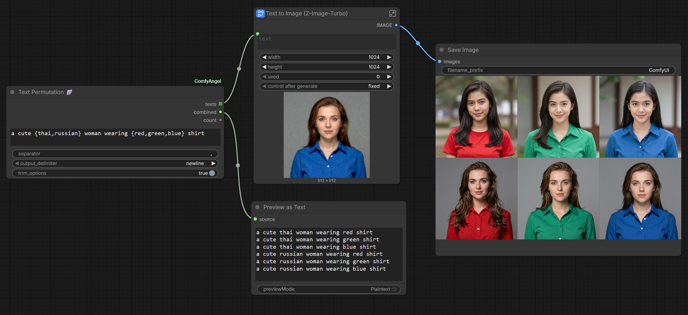

### Load Image + Metadata | Parameter Overlay | Image Bridge — Easy to place watermark
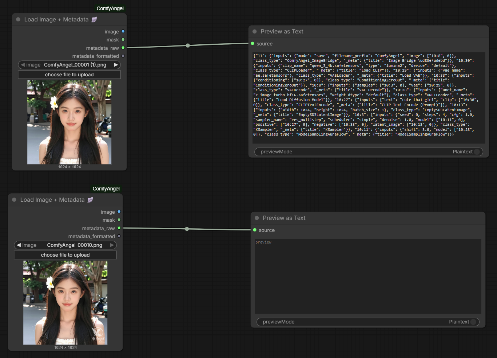
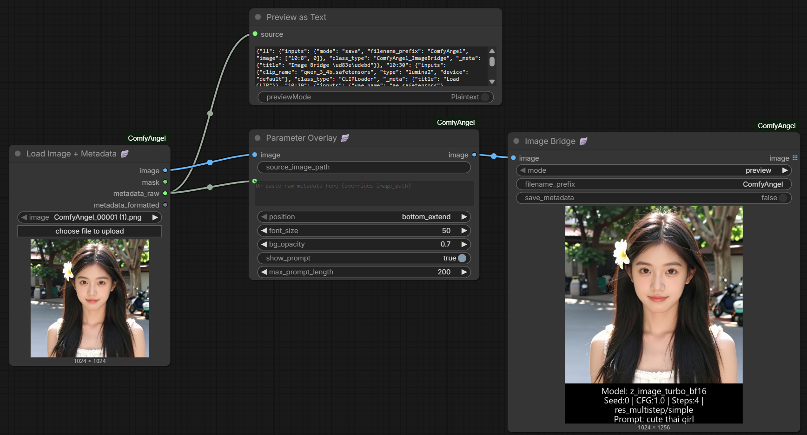

### Loop Start | Loop End — Easy batch processing each item from items list (supports text and image)
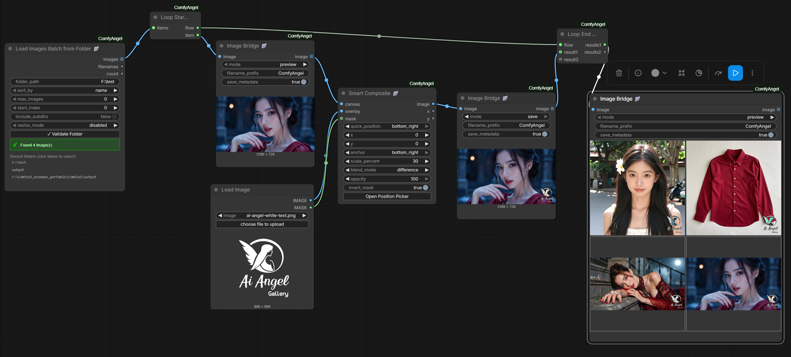

### Smart Composite — Visual Position Picker
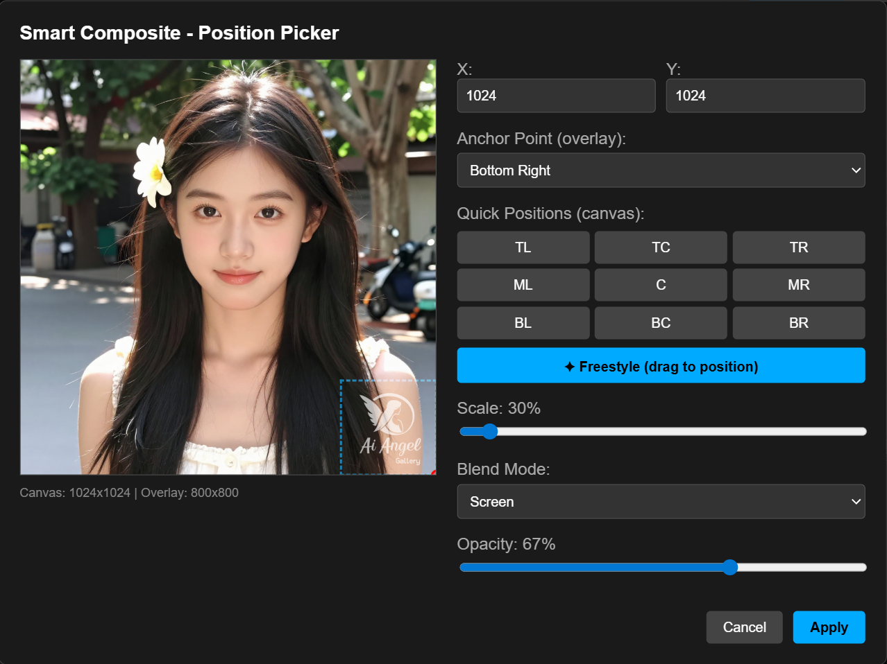
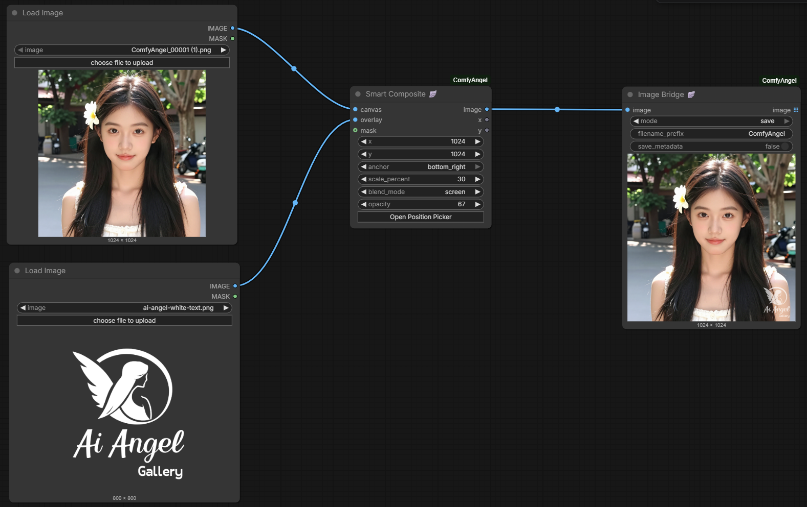

### Smart Crop — Visual Crop Editor
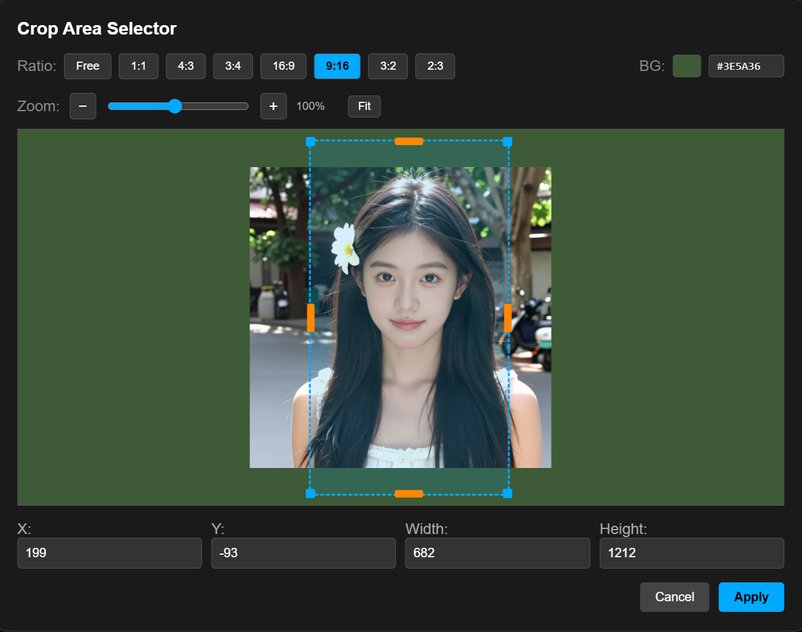
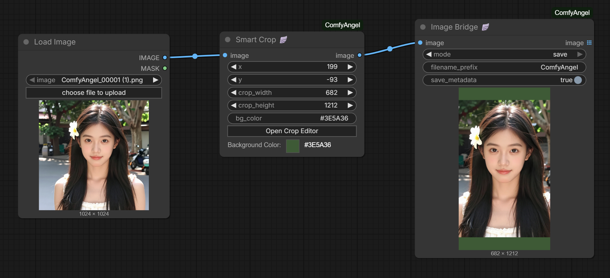

### Widget Nodes — Color Picker, Resolution Picker, Solid Color
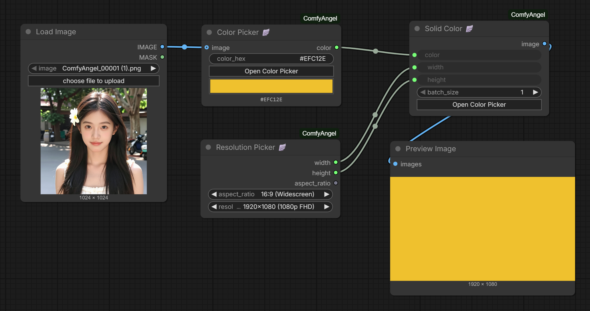
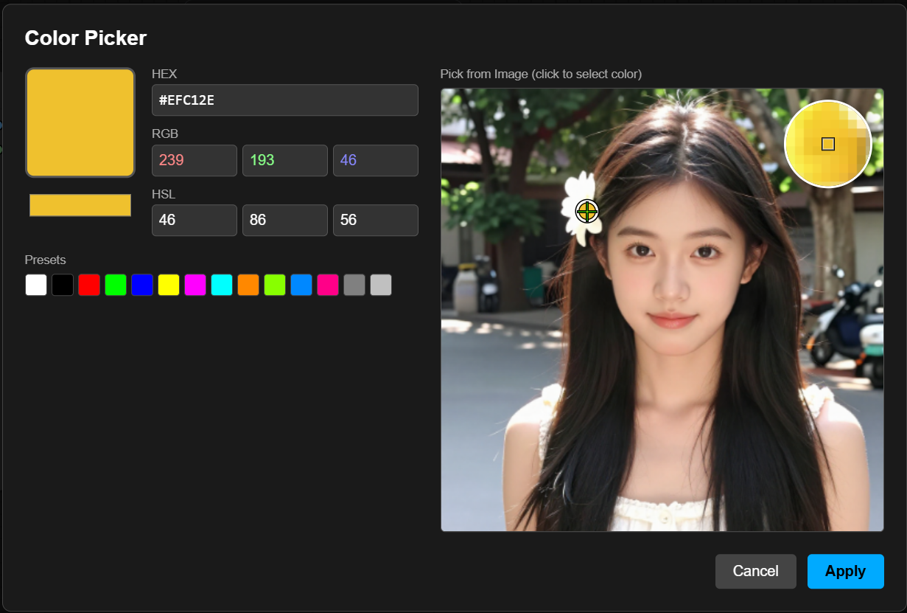

---

## Node Index (A-Z)

| Node | Description |
|------|-------------|
| [Color Picker](#color-picker-) | Interactive color picker with eyedropper |
| [Custom Text Overlay](#custom-text-overlay-) | Add custom text overlay with full styling |
| [Image Bridge](#image-bridge-) | Preview/save images without breaking the chain |
| [Image Info](#image-info-) | Get dimensions and batch info |
| [JSON Extract](#json-extract-) | Extract values from JSON using field paths |
| [Load Image + Metadata](#load-image--metadata-) | Load image and extract generation metadata |
| [Load Images Batch from Folder](#load-images-batch-from-folder-) | Load images from folder with validation |
| [Loop End](#loop-end-) | End loop and collect results |
| [Loop Start](#loop-start-) | Start loop over items |
| [Parameter Overlay](#parameter-overlay-) | Add generation parameters as visual overlay |
| [Parameter Parser](#parameter-parser-) | Parse metadata and extract parameters |
| [Resolution Picker](#resolution-picker-) | Select from common resolutions by aspect ratio |
| [Smart Composite](#smart-composite-) | Composite overlay with visual position picker |
| [Smart Crop](#smart-crop-) | Crop image with visual editor |
| [Solid Color](#solid-color-) | Generate solid color image |
| [Split Image Batch](#split-image-batch-) | Extract single image from batch by index |
| [Text Combine](#text-combine-) | Combine multiple text strings |
| [Text Permutation](#text-permutation-) | Generate all combinations from template |
| [Workflow Metadata](#workflow-metadata-) | Output current workflow as JSON |

---

## Installation

### ComfyUI Registry (Recommended)
```bash
comfy node install comfyangel
```

### ComfyUI Manager
Search for "ComfyAngel" in ComfyUI Manager and click Install.

### Manual Installation
```bash
cd ComfyUI/custom_nodes
git clone https://github.com/ThepExcel/ComfyAngel.git
```

Then restart ComfyUI.

---

## Nodes

### Loop Nodes

True loop functionality **without Auto Queue**. Iterate through batches/lists and accumulate results in a single execution.


---

#### Loop Start 🪽

Start a loop over items.

| Input | Type | Description |
|-------|------|-------------|
| items | ANY | Batch/list to iterate over. Accepts IMAGE batch, lists of strings, or any iterable. |

| Output | Type | Description |
|--------|------|-------------|
| flow | FLOW_CONTROL | **Must connect to Loop End.** |
| item | ANY | Current item from the batch for this iteration. |

**Example - Loop through text prompts:**
```
[Text Permutation] outputs: ["cat on chair", "cat on sofa", "dog on chair", "dog on sofa"]
         ↓
[Loop Start] iteration 0: item = "cat on chair"
[Loop Start] iteration 1: item = "cat on sofa"
[Loop Start] iteration 2: item = "dog on chair"
[Loop Start] iteration 3: item = "dog on sofa"
```

---

#### Loop End 🪽

End a loop and collect all results into a single output.

| Input | Type | Description |
|-------|------|-------------|
| flow | FLOW_CONTROL | **Must connect from Loop Start.** |
| result1 | ANY | Value to collect from each iteration (optional). |
| result2 | ANY | Second value to collect (optional). |

| Output | Type | Description |
|--------|------|-------------|
| results1 | ANY | All accumulated results from result1. |
| results2 | ANY | All accumulated results from result2. |

**v0.6.0:** Loop End now executes even without downstream connections. You can run loops without connecting nodes to the results outputs.

**Accumulation behavior:**
- **IMAGE/MASK tensors:** Concatenated into a batch tensor. 4 images → tensor shape (4, H, W, C)
- **Strings:** Collected into a Python list.
- **Other types:** Collected into a Python list.

---

### Loader Nodes

#### Load Images Batch from Folder 🪽

Load images from a folder with folder browser, validation, and history.

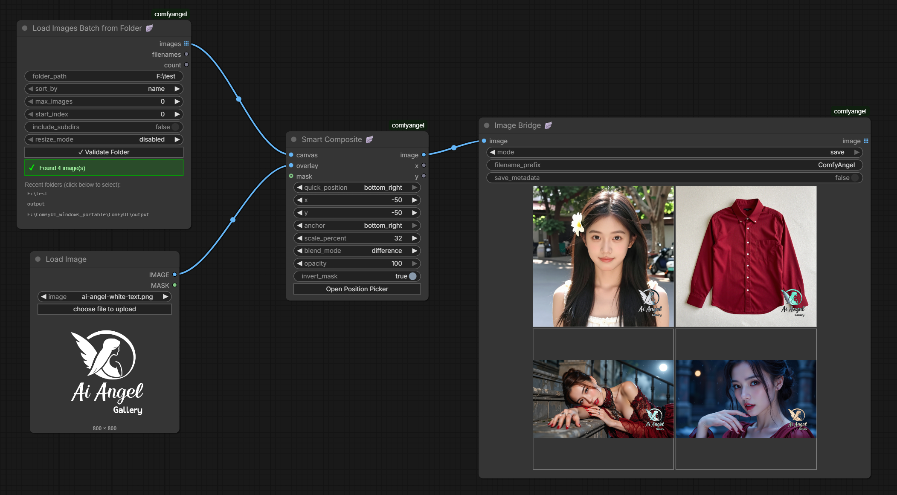

| Input | Type | Description |
|-------|------|-------------|
| folder_path | STRING | Path to folder. Use **Validate Folder** button to check. |
| sort_by | ENUM | `name`, `modified_date`, `created_date` |
| max_images | INT | Maximum images to load. `0` = unlimited. |
| start_index | INT | Skip first N images. |
| include_subdirs | BOOLEAN | Scan subfolders recursively. |
| resize_mode | ENUM | `disabled`, `resize_to_first`, `resize_to_largest`, `resize_to_smallest` |

| Output | Type | Description |
|--------|------|-------------|
| images | IMAGE[] | **List** of images (preserves RGBA when present). |
| filenames | STRING | Newline-separated list of loaded filenames. |
| count | INT | Number of images loaded. |

**Features:**
- **Validate Folder button:** Shows image count and validates path
- **Folder history:** Recent folders saved for quick access
- **RGBA preservation:** Images with alpha channels are preserved as 4-channel tensors

---

#### Split Image Batch 🪽

Extract a single image from a batch by index. Useful for Auto Queue workflows.

| Input | Type | Description |
|-------|------|-------------|
| images | IMAGE | Batch of images to split. |
| index | INT | Which image to extract (0-based). Auto-increments with Auto Queue. |
| loop | BOOLEAN | Wrap around when index exceeds batch size. Default: true |

| Output | Type | Description |
|--------|------|-------------|
| image | IMAGE | Single image at the specified index. |
| index | INT | The actual index used. |
| total_count | INT | Total images in the batch. |

---

### Text Utility Nodes

#### Text Permutation 🪽

Generate all combinations from a template with inline options.


| Input | Type | Description |
|-------|------|-------------|
| template | STRING | Template with `{option1,option2}` syntax. |
| separator | STRING | Separator inside braces. Default: `,` |
| trim_options | BOOLEAN | Remove whitespace around options. Default: true |

| Output | Type | Description |
|--------|------|-------------|
| texts | STRING[] | List of all combinations. |
| count | INT | Number of combinations. |

**Example:**
```
Template: "a {cat,dog} on a {chair,sofa}"

Output (4 combinations):
- "a cat on a chair"
- "a cat on a sofa"
- "a dog on a chair"
- "a dog on a sofa"
```

---

#### Text Combine 🪽

Combine multiple text strings into one.

| Input | Type | Description |
|-------|------|-------------|
| text1-4 | STRING | Texts to combine (text1 required, others optional). |
| separator | STRING | String between texts. Default: `\n` |

| Output | Type | Description |
|--------|------|-------------|
| combined | STRING | All non-empty texts joined. |

---

#### JSON Extract 🪽

Extract values from JSON using field paths.

| Input | Type | Description |
|-------|------|-------------|
| json_string | STRING | JSON text to parse. |
| fields | STRING | Field paths, one per line. |
| delimiter | ENUM | Field separator: `newline`, `comma`, `pipe`, `semicolon` |
| output_delimiter | ENUM | Output value separator. |
| default_value | STRING | Value when field not found. |

| Output | Type | Description |
|--------|------|-------------|
| values | STRING[] | List of extracted values. |
| values_joined | STRING | All values joined. |
| count | INT | Number of fields extracted. |

**Field path syntax:**
```
seed                    → json["seed"]
3.inputs.steps          → json["3"]["inputs"]["steps"]
nodes[0].type           → json["nodes"][0]["type"]
```

**Browse JSON Fields button:** Opens visual JSON tree viewer.

---

### Overlay Nodes

#### Load Image + Metadata 🪽

Load an image and extract embedded generation metadata.


| Input | Type | Description |
|-------|------|-------------|
| image | IMAGE_UPLOAD | Select image file. |

| Output | Type | Description |
|--------|------|-------------|
| image | IMAGE | The loaded image. |
| mask | MASK | Alpha channel as mask. |
| metadata_raw | STRING | Raw metadata string. |
| metadata_formatted | STRING | Human-readable formatted parameters. |

**Supported formats:** A1111/Civitai, ComfyUI workflow embedding

---

#### Parameter Parser 🪽

Parse metadata string and extract individual parameters.

| Input | Type | Description |
|-------|------|-------------|
| metadata | STRING | Raw metadata string. |
| show_prompt | BOOLEAN | Include prompt in output. |
| max_prompt_length | INT | Truncate prompt length. |

| Output | Type | Description |
|--------|------|-------------|
| formatted | STRING | Human-readable summary. |
| model | STRING | Checkpoint/model name. |
| sampler | STRING | Sampler name. |
| seed | INT | Generation seed. |
| steps | INT | Sampling steps. |
| cfg | FLOAT | CFG scale. |
| positive_prompt | STRING | Positive prompt. |
| negative_prompt | STRING | Negative prompt. |

---

#### Parameter Overlay 🪽

Add generation parameters as a visual overlay on an image.


| Input | Type | Description |
|-------|------|-------------|
| image | IMAGE | Image to add overlay to. |
| image_path | STRING | Optional. Path to read metadata from. |
| metadata_text | STRING | Optional. Raw metadata text. |
| position | ENUM | `bottom_extend`, `bottom_inside`, `top_inside` |
| font_size | INT | Text size 8-100. Default: 25 |
| bg_opacity | FLOAT | Background opacity 0.0-1.0. Default: 0.7 |
| show_prompt | BOOLEAN | Include prompt text. Default: false |
| max_prompt_length | INT | Truncate prompt length. Default: 200 |

| Output | Type | Description |
|--------|------|-------------|
| image | IMAGE | Image with parameter overlay. |

---

#### Custom Text Overlay 🪽

Add custom text overlay with full styling control.

| Input | Type | Description |
|-------|------|-------------|
| image | IMAGE | Image to add overlay to. |
| text | STRING | Text to display (supports `\n`). |
| position | ENUM | `bottom_extend`, `bottom_inside`, `top_inside` |
| font_size | INT | Text size 8-100. |
| bg_opacity | FLOAT | Background opacity. |
| text_color | STRING | Text color hex. Default: `#FFFFFF` |
| bg_color | STRING | Background color hex. Default: `#000000` |

| Output | Type | Description |
|--------|------|-------------|
| image | IMAGE | Image with text overlay. |

---

### Composite Nodes

#### Smart Composite 🪽

Composite (layer) an overlay image onto a canvas with visual position picker.


| Input | Type | Description |
|-------|------|-------------|
| canvas | IMAGE | Background image (connect via Image Bridge for preview). |
| overlay | IMAGE | Image to place on top. |
| quick_position | ENUM | Reference point: `free`, `top_left`, `top_center`, `top_right`, `middle_left`, `center`, `middle_right`, `bottom_left`, `bottom_center`, `bottom_right` |
| x | INT | Horizontal **offset from quick_position**. |
| y | INT | Vertical **offset from quick_position**. |
| anchor | ENUM | Which point of overlay aligns to position. |
| scale_percent | FLOAT | Resize overlay 1-500%. Default: 100 |
| blend_mode | ENUM | `normal`, `multiply`, `screen`, `overlay`, `soft_light`, `hard_light`, `difference`, `add`, `subtract` |
| opacity | FLOAT | Overlay transparency 0-100%. |
| mask | MASK | Optional. External mask for overlay transparency. |
| invert_mask | BOOLEAN | Invert the mask (ComfyUI LoadImage masks are inverted). Default: true |

| Output | Type | Description |
|--------|------|-------------|
| image | IMAGE | Composited result. |
| x | INT | Final X position. |
| y | INT | Final Y position. |

**v0.6.0 Updates:**
- **Quick Position as reference point:** X,Y are now offsets from the quick position, not absolute coordinates
- **Mask input:** Connect MASK output from LoadImage for overlay transparency
- **Invert mask option:** ComfyUI's LoadImage MASK is inverted (0=opaque), enable invert_mask to correct this

**Visual Editor Features:**
- Drag overlay directly on preview
- Quick position buttons for corners/edges/center
- Scale slider with live preview

---

### Utility Nodes

#### Image Bridge 🪽

Pass-through node that previews or saves images without breaking the chain.

| Input | Type | Description |
|-------|------|-------------|
| image | IMAGE | Image(s) to preview/save. Handles different sizes. |
| mode | ENUM | `preview` or `save` |
| filename_prefix | STRING | Prefix for saved files. |

| Output | Type | Description |
|--------|------|-------------|
| image | IMAGE | Same image passed through. |

**Essential for loops:** Place inside loop to see each iteration's result.

**v0.6.0:** Now handles batches with different-sized images correctly.

---

#### Workflow Metadata 🪽

Output current workflow as JSON strings.

| Output | Type | Description |
|--------|------|-------------|
| prompt_json | STRING | Current prompt as JSON. |
| workflow_json | STRING | Full workflow as JSON. |

---

#### Image Info 🪽

Get dimensions and batch info from an image.

| Input | Type | Description |
|-------|------|-------------|
| image | IMAGE | Image tensor. |

| Output | Type | Description |
|--------|------|-------------|
| width | INT | Image width. |
| height | INT | Image height. |
| channels | INT | Number of channels. |
| batch_size | INT | Number of images in batch. |

---

### Widget Nodes


#### Resolution Picker 🪽

Select from common image resolutions by aspect ratio.

| Input | Type | Description |
|-------|------|-------------|
| aspect_ratio | ENUM | `1:1`, `4:3`, `3:4`, `16:9`, `9:16`, `21:9`, `3:2`, `2:3` |
| resolution | ENUM | Specific resolution (options change based on ratio). |

| Output | Type | Description |
|--------|------|-------------|
| width | INT | Selected width. |
| height | INT | Selected height. |
| aspect_ratio | STRING | The ratio string. |

**Presets:** SD 1.5, SDXL, SD3/Flux, DALL-E 3, Midjourney, Standard (FHD, 4K)

---

#### Solid Color 🪽

Generate a solid color image.

| Input | Type | Description |
|-------|------|-------------|
| color | STRING | Hex color (e.g., `#FF0000`). |
| width | INT | Image width. |
| height | INT | Image height. |
| batch_size | INT | Number of images. |

| Output | Type | Description |
|--------|------|-------------|
| image | IMAGE | Solid color image. |

---

#### Color Picker 🪽

Interactive color picker with eyedropper.


| Input | Type | Description |
|-------|------|-------------|
| color_hex | STRING | Color in hex format. |
| image | IMAGE | Optional. Connect for eyedropper. |

| Output | Type | Description |
|--------|------|-------------|
| color | STRING | Normalized hex color. |

**Features:** Visual picker, HEX/RGB/HSL input, color presets, eyedropper tool

---

#### Smart Crop 🪽

Crop image with visual editor.


| Input | Type | Description |
|-------|------|-------------|
| image | IMAGE | Image to crop. |
| x | INT | Left edge of crop. |
| y | INT | Top edge of crop. |
| crop_width | INT | Width of crop. |
| crop_height | INT | Height of crop. |
| bg_color | STRING | Background color for out-of-bounds areas. |

| Output | Type | Description |
|--------|------|-------------|
| image | IMAGE | Cropped image. |

**Visual editor:** Click button to open drag-to-select crop area.

---

## Tips & Best Practices

### Loop Performance
- **Image Bridge is essential** - Without it, you won't see intermediate results
- **No downstream required** - Loop End now runs even without connected outputs (v0.6.0)
- **Memory usage** - Each iteration accumulates in memory. For large batches, use Split Image Batch with Auto Queue

### Smart Composite Workflow
```
[Load Image] → [Image Bridge] → canvas [Smart Composite]
                                overlay ← [Load Logo]
                                mask ← [Load Logo].mask (with invert_mask: true)
```

### Metadata Workflow
```
[Load Image + Metadata] → metadata_raw
         ↓
[Parameter Parser] → formatted, model, seed, etc.
         ↓
[Parameter Overlay] ← original image
         ↓
[Save Image]
```

---

## Example Workflows

Download and drag into ComfyUI to try:

| Workflow | Description |
|----------|-------------|
| [Text Permutation](examples/Text%20Permutation.json) | Generate prompt combinations and batch process |
| [Load Images Batch from Folder](examples/LoadImagesBatchFromFolder.json) | Load all images from a folder |
| [LoadImageBatch + Loop](examples/LoadImageBatch-Loop.json) | Load folder of images and process each with Loop nodes |
| [Smart Crop](examples/SmartCrop.json) | Visual crop editor demo |
| [Color & Resolution Picker](examples/Color-Resolution-Picker.json) | Widget nodes for color and resolution selection |

---

## Changelog

### v0.6.0
- **Loop End:** Now executes without downstream connections
- **Smart Composite:** Quick position is now a reference point (X,Y are offsets)
- **Smart Composite:** Added mask input with invert_mask option for transparency
- **Image Bridge:** Handles different-sized images in batches
- **Load Images Batch:** Preserves RGBA channels

### v0.5.0
- Added JSON Extract node with visual field browser
- Image Bridge preview improvements
- Various bug fixes

---

## Links

- **GitHub:** https://github.com/ThepExcel/ComfyAngel
- **Registry:** https://registry.comfy.org/thepexcel/comfyangel

---

## License

MIT
